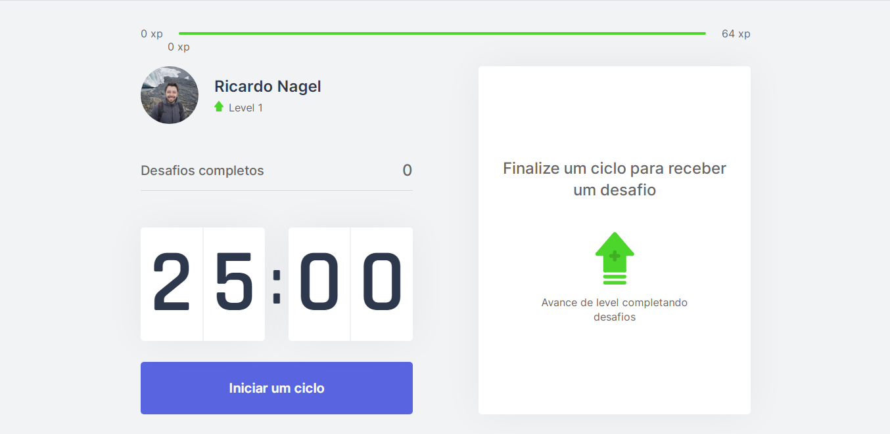
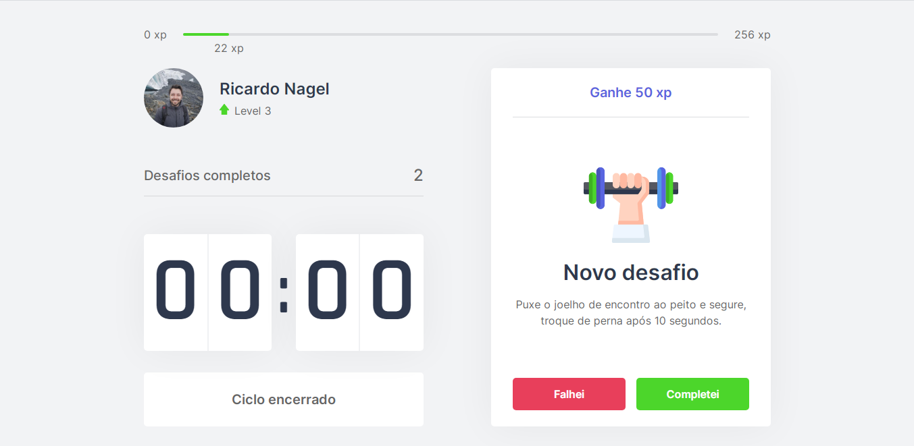

<h1  align="center"></h1>

<p></p>

### 🏠 [Clique aqui e confira a aplicação Move.it !](https://moveit-rk9ld8flt-nagelricardo.vercel.app/)

> 🚀 Move It é uma aplicação para gestão de tempo que estimula devs a praticar exercícios

<p align="center">
 <a href="#overview">Overview</a> •
 <a href="#demonstracao">Demonstração</a> •
 <a href="#comousar">Como usar</a> •
 <a href="#tecnologias">Tecnologias</a> • 
 <a href="#autora">Autor</a>
</p>

<h2 id="overview">✨ Overview</h2>

<p>
  A gestão de tempo é realizada através de um cronômetro que marca ciclos de 25 minutos de trabalho. Após finalizar cada ciclo um desafio é disponibilizado. Completando o desafio, o usuário receberá pontos que acumulados fazem o mesmo subir de nível.
  
  Os desafios se tratam de exercícios de alongamento para o corpo e olhos, além de lembretes para o dev hidratar-se consumindo água.

  A aplicação foi desenvolvida durante a Next Level Week #4 promovida pela Rocketseat. 🚀 
</p>

<h2 id="demonstracao">🖱 Demonstração</h2>

<p>
  <span></span>
  <span></span>
</p>

<h2 id="comousar">⚒️ Como usar</h2>

<h3>Pré-requisitos</h3>

<p>
    Para iniciar o desenvolvimento é necessário primeiramente que você instale as seguintes ferramentas:
    <ul>
      <li><a href="https://nodejs.org/en/">Node.js</a></li>
      <li><a href="https://yarnpkg.com/">Yarn</a></li>
    </ul>

    Recomendo para uma melhor experiência no desenvolvimento da aplicação Move.it utilizar o editor de código Visual Studio Code. 
  <a href="https://code.visualstudio.com/">VSCode</a>
</p>

<h3>Instalação</h3>
  <p>Abra o projeto no seu editor de código ou no terminal do seu computador e execute o comando abaixo.</p>

  ```sh

yarn install

```

<h3>Rodando a aplicação</h3>
  <p>No terminal execute o comando abaixo.</p>

```sh

yarn dev

```

<p>A aplicação será aberta na porta:3000. No seu navegador acesse http://localhost:3000</p>


<h2 id="tecnologias">🛸 Tecnologias</h2>
  
  <p>
    As seguintes ferramentas foram utilizadas no desenvolvimento dessa aplicação:
    <ul>
      <li><a href="https://nodejs.org/en/">Node.js</a></li>
      <li><a href="https://pt-br.reactjs.org/">React.js</a></li>
      <li><a href="https://nextjs.org/">Next.js</a></li>
      <li><a href="https://www.typescriptlang.org/">TypeScript</a></li>
    </ul>
  </p>

  <h2 id="autora">👤 Autor</h2>

<h3>Desenvolvido por Ricardo Nagel com auxílio da Rocketseat 🚀 </h3>

* [Linkedin](https://www.linkedin.com/in/ricardonagel/)

  
<strong align="center">Deixe sua ⭐️ se gostou do projeto</strong>

  
